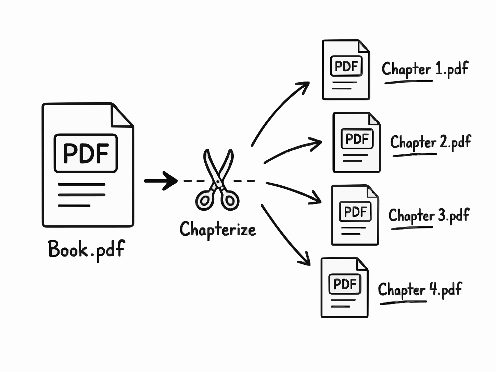

# ✂️ Chapterize

Chapterize is a client-side web app that detects chapter boundaries in PDF books with Google Gemini and exports each chapter as a separate PDF.



## Features

- **AI-assisted chapter detection:** Uses Gemini to identify chapter starts from lightweight page text snippets.
- **Browser-based PDF processing:** Splitting and ZIP generation happen locally in the browser.
- **Privacy-conscious workflow:** The full PDF binary is not uploaded by Chapterize; only extracted text snippets are sent to Gemini.
- **Bulk export:** Download chapters individually or as a ZIP archive.
- **Static deployment:** Built with React and Vite, so it can be hosted on any static site platform.

## Tech Stack

- React and Vite
- Tailwind CSS
- Google Gemini via `@google/generative-ai`
- pdf.js for text extraction
- pdf-lib for PDF generation
- JSZip for archive downloads

## Quick Start

### Prerequisites

- Node.js 18 or newer
- npm
- A Gemini API key from [Google AI Studio](https://aistudio.google.com/app/apikey)

### Setup

```sh
git clone <repository-url>
cd chapterize
npm install
cp .env.example .env
```

Add your Gemini API key to `.env`:

```sh
VITE_GEMINI_API_KEY=your_gemini_api_key_here
```

Start the development server:

```sh
npm run dev
```

## Available Scripts

- `npm run dev` starts the local Vite development server.
- `npm run build` creates a production build.
- `npm run preview` previews the production build locally.
- `npm run lint` runs ESLint.

## How It Works

1. Chapterize loads the PDF in the browser with pdf.js.
2. It extracts the first 300 characters of text from each page.
3. It sends those snippets to Gemini and asks for structured chapter start pages.
4. It uses pdf-lib to split the original PDF in memory.
5. It generates individual PDF downloads and an optional ZIP archive.

## Privacy and API Keys

Chapterize is a client-side app. Your full PDF file is not uploaded by the app, but page text snippets are sent to Gemini for analysis.

Because the app runs in the browser, any API key included in a deployed public build can be visible to users. Restrict deployed keys by HTTP referrer, set quota limits, and never commit `.env`.

## Documentation

- [Setup Instructions](./setup_instructions.md)
- [Architecture](./ARCHITECTURE.md)
- [Deployment Guide](./DEPLOYMENT.md)
- [Contributing](./CONTRIBUTING.md)
- [Security Policy](./SECURITY.md)

## License

Chapterize is open source under the [MIT License](./LICENSE).